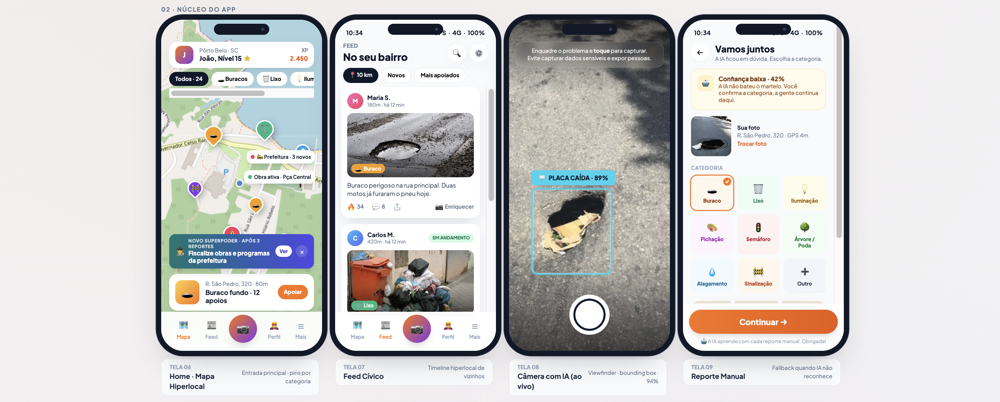
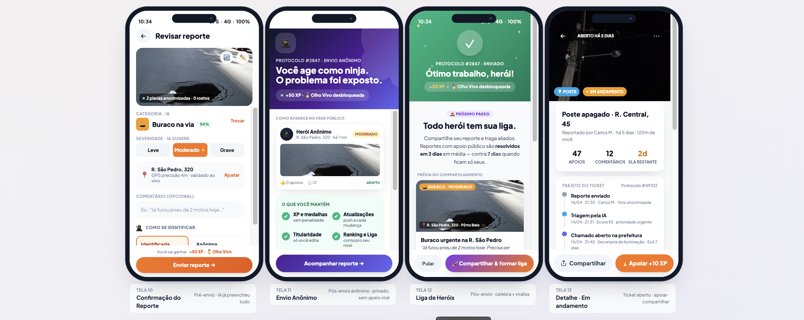

# 🏙️ CityHero: Technical and Strategic Documentation

**Version:** 1.0
**Concept:** Intelligent Urban Maintenance & Citizen Engagement Platform.




---

## 1. Product Overview

**CityHero** is a software ecosystem designed to resolve the disconnect between the population (who sees the problems) and the City Hall (which has limited resources to solve them).

* **Key Differentiator:** Unlike current systems (bureaucratic and form-based), CityHero utilizes **Artificial Intelligence (Computer Vision)**, **Gamification**, and **Data Prediction** to optimize city maintenance.
* **Entry Strategy:** Act as an "Intelligence Layer" (Overlay) on top of the City Halls' legacy systems (ERPs), without attempting to replace them in the short term.

### 1.2 Prototype

```
cd design/
python3 -m http.server 5173
```
